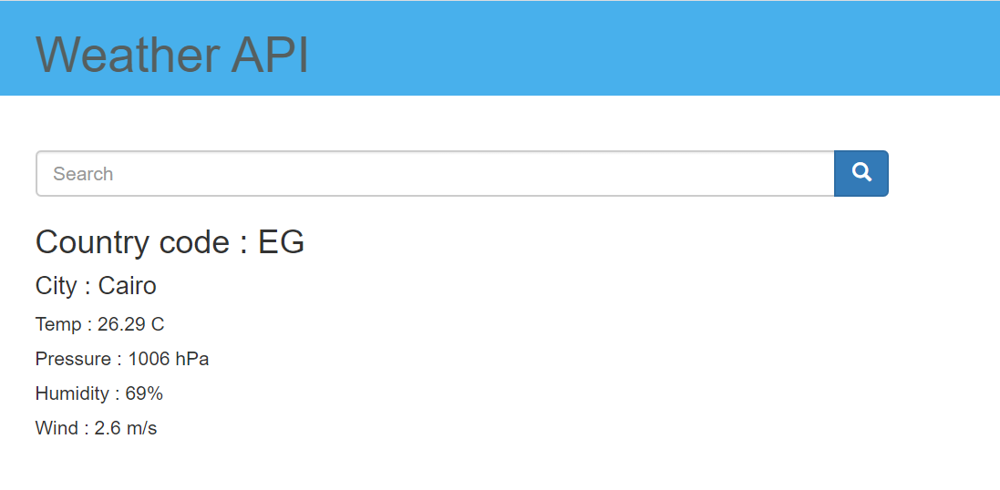

# weather_API
An API that uses openweather API to get the weather for any city.
  1- Run the weather.py file
  2- Enter http:\\127.0.0.1:5000\\ in your browser.
  3- Enter the city you want to search for using the following format "city,country" then click search or just hit enter :D.
  
  

